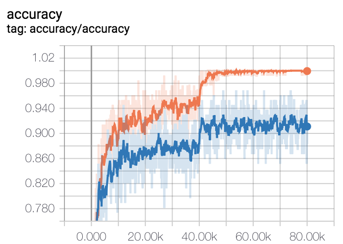
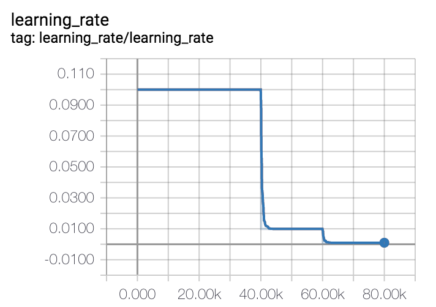
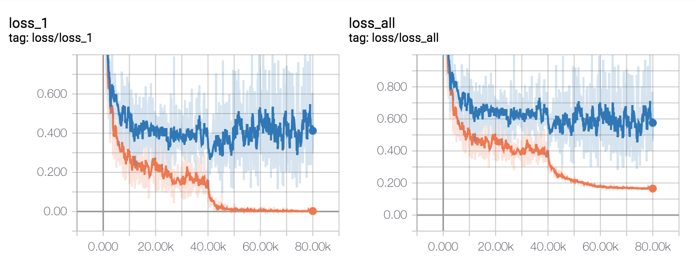

## About
A Tensorflow implementation of [Resnet](http://openaccess.thecvf.com/content_cvpr_2016/papers/He_Deep_Residual_Learning_CVPR_2016_paper.pdf),[Resnetv2](https://arxiv.org/pdf/1603.05027.pdf) trained on [cifar10](https://www.cs.toronto.edu/~kriz/cifar.html). The tese accuracy is **91.97%(93.03% in paper)**.

+ layer: 56

## Train

> python train.py

## Test

> python predict.py

## Results

#### accuracy




#### learning rte



#### loss



#### test results

```
on batch size: 100, test accuracy: 0.910000
on batch size: 100, test accuracy: 0.940000
on batch size: 100, test accuracy: 0.900000
on batch size: 100, test accuracy: 0.900000
on batch size: 100, test accuracy: 0.930000
on batch size: 100, test accuracy: 0.970000
on batch size: 100, test accuracy: 0.900000
on batch size: 100, test accuracy: 0.930000
on batch size: 100, test accuracy: 0.920000
on batch size: 100, test accuracy: 0.920000
on batch size: 100, test accuracy: 0.970000
on batch size: 100, test accuracy: 0.940000
on batch size: 100, test accuracy: 0.880000
on batch size: 100, test accuracy: 0.950000
on batch size: 100, test accuracy: 0.920000
on batch size: 100, test accuracy: 0.920000
on batch size: 100, test accuracy: 0.910000
on batch size: 100, test accuracy: 0.910000
on batch size: 100, test accuracy: 0.900000
on batch size: 100, test accuracy: 0.970000
on batch size: 100, test accuracy: 0.910000
on batch size: 100, test accuracy: 0.880000
on batch size: 100, test accuracy: 0.940000
on batch size: 100, test accuracy: 0.910000
on batch size: 100, test accuracy: 0.950000
on batch size: 100, test accuracy: 0.850000
on batch size: 100, test accuracy: 0.950000
on batch size: 100, test accuracy: 0.950000
on batch size: 100, test accuracy: 0.920000
on batch size: 100, test accuracy: 0.960000
on batch size: 100, test accuracy: 0.880000
on batch size: 100, test accuracy: 0.870000
on batch size: 100, test accuracy: 0.920000
on batch size: 100, test accuracy: 0.930000
on batch size: 100, test accuracy: 0.830000
on batch size: 100, test accuracy: 0.890000
on batch size: 100, test accuracy: 0.900000
on batch size: 100, test accuracy: 0.920000
on batch size: 100, test accuracy: 0.920000
on batch size: 100, test accuracy: 0.930000
on batch size: 100, test accuracy: 0.890000
on batch size: 100, test accuracy: 0.900000
on batch size: 100, test accuracy: 0.930000
on batch size: 100, test accuracy: 0.950000
on batch size: 100, test accuracy: 0.980000
on batch size: 100, test accuracy: 0.950000
on batch size: 100, test accuracy: 0.940000
on batch size: 100, test accuracy: 0.930000
on batch size: 100, test accuracy: 0.920000
on batch size: 100, test accuracy: 0.910000
on batch size: 100, test accuracy: 0.930000
on batch size: 100, test accuracy: 0.910000
on batch size: 100, test accuracy: 0.930000
on batch size: 100, test accuracy: 0.930000
on batch size: 100, test accuracy: 0.880000
on batch size: 100, test accuracy: 0.940000
on batch size: 100, test accuracy: 0.880000
on batch size: 100, test accuracy: 0.920000
on batch size: 100, test accuracy: 0.930000
on batch size: 100, test accuracy: 0.950000
on batch size: 100, test accuracy: 0.970000
on batch size: 100, test accuracy: 0.920000
on batch size: 100, test accuracy: 0.950000
on batch size: 100, test accuracy: 0.940000
on batch size: 100, test accuracy: 0.960000
on batch size: 100, test accuracy: 0.910000
on batch size: 100, test accuracy: 0.930000
on batch size: 100, test accuracy: 0.950000
on batch size: 100, test accuracy: 0.950000
on batch size: 100, test accuracy: 0.920000
on batch size: 100, test accuracy: 0.870000
on batch size: 100, test accuracy: 0.960000
on batch size: 100, test accuracy: 0.900000
on batch size: 100, test accuracy: 0.910000
on batch size: 100, test accuracy: 0.900000
on batch size: 100, test accuracy: 0.920000
on batch size: 100, test accuracy: 0.930000
on batch size: 100, test accuracy: 0.940000
on batch size: 100, test accuracy: 0.910000
on batch size: 100, test accuracy: 0.910000
on batch size: 100, test accuracy: 0.920000
on batch size: 100, test accuracy: 0.880000
on batch size: 100, test accuracy: 0.940000
on batch size: 100, test accuracy: 0.940000
on batch size: 100, test accuracy: 0.910000
on batch size: 100, test accuracy: 0.890000
on batch size: 100, test accuracy: 0.880000
on batch size: 100, test accuracy: 0.920000
on batch size: 100, test accuracy: 0.920000
on batch size: 100, test accuracy: 0.870000
on batch size: 100, test accuracy: 0.940000
on batch size: 100, test accuracy: 0.920000
on batch size: 100, test accuracy: 0.890000
on batch size: 100, test accuracy: 0.940000
on batch size: 100, test accuracy: 0.890000
on batch size: 100, test accuracy: 0.920000
on batch size: 100, test accuracy: 0.930000
on batch size: 100, test accuracy: 0.900000
on batch size: 100, test accuracy: 0.930000
on batch size: 100, test accuracy: 0.890000
The test set number is 10000, the average accuracy is 0.919700
```